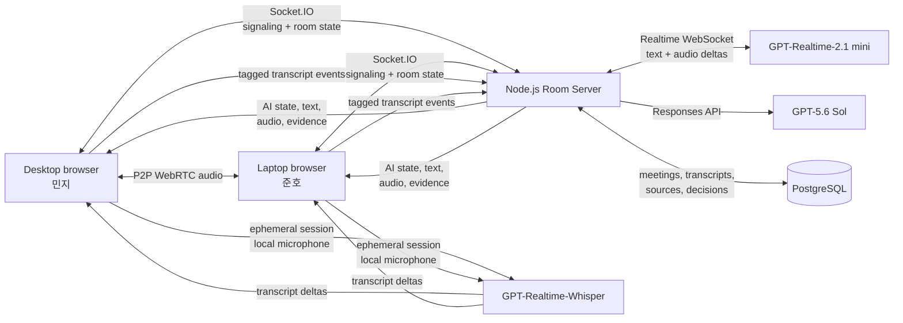

# Recap MVP System Design

- Status: Approved
- Architecture: Two-person P2P audio room with server-coordinated AI
- Stack: React, Vite, Node.js, TypeScript, WebRTC, WebSocket, PostgreSQL

## 1. Design goals

The system must prioritize a reliable four-minute Build Week demo over production scale. Its boundaries are:

- exactly two human participants;
- audio and avatars only;
- direct P2P human audio;
- per-participant streaming transcription;
- one server-coordinated AI participant;
- evidence-backed GPT-5.6 Sol reasoning; and
- human-approved decision persistence.

## 2. Technology choices

| Layer | Choice | Reason |
|---|---|---|
| Frontend | React + Vite + TypeScript | Fast browser iteration and direct WebRTC access |
| Backend | Node.js + TypeScript | Shared event types and one-language development |
| HTTP server | Express | Minimal server and static build hosting |
| Room transport | Socket.IO over WebSocket | Signaling, reconnection, room broadcasts, and binary AI audio |
| Human media | Native `RTCPeerConnection` | Direct audio between two browsers without an SFU |
| Runtime validation | Zod | Validate client events and model-generated structures |
| Database | PostgreSQL | Durable meeting, transcript, evidence, and decision relations |
| Database access | Drizzle ORM | Typed schema and migrations in TypeScript |
| Transcription | `gpt-realtime-whisper` | Low-latency participant-specific transcript deltas |
| Voice coordinator | `gpt-realtime-2.1-mini` | Short AI speech and function-tool orchestration |
| Deep reasoning | `gpt-5.6-sol` via Responses API | Compare past evidence with current meeting context |

The React build is served by the Node.js process in deployment. The public host must support HTTPS, long-lived WebSockets, and a persistent Node.js process. A Docker image is the portable deployment artifact; the host vendor is not an architectural dependency.

## 3. High-level architecture



## 4. Component boundaries

### Browser meeting client

Responsibilities:

- capture and mute the local microphone;
- establish the human P2P audio connection;
- request an ephemeral OpenAI transcription session from the server;
- send local audio to its transcription session;
- attach the authenticated room participant ID to transcript deltas;
- render room presence, live transcript, AI state, evidence, and Decision Wiki;
- play server-broadcast AI audio; and
- surface reconnect and text-only fallbacks.

The browser never receives the standard OpenAI API key or database credentials.

### Room server

Responsibilities:

- create and validate room capability URLs;
- limit a room to two human participant IDs;
- exchange WebRTC offer, answer, and ICE candidate messages;
- validate and broadcast room events;
- persist final transcript segments;
- maintain one ordered meeting context;
- coordinate AI questions and tool results;
- broadcast AI state, text, evidence, and audio to both clients;
- enforce decision approval; and
- isolate every database query by room and meeting ID.

### AI tool orchestrator

The orchestrator exposes these server-owned functions:

- `search_decision_wiki`
- `search_transcript`
- `analyze_with_sol`
- `propose_decision`
- `save_decision`

It validates all arguments with Zod. The model can request a tool, but the server decides whether the request is authorized and performs the operation.

### OpenAI transcription sessions

Each browser uses its own transcription session so speaker identity comes from the authenticated participant connection rather than model diarization. Partial text stays ephemeral in the client; final transcript segments are sent to the room server and persisted.

### GPT-5.6 Sol reasoning service

The server sends Sol only:

- the user's question;
- the recent current-meeting transcript;
- the top matching prior transcript segments;
- matching Decision Wiki records; and
- a structured output schema.

Sol returns an answer, reasoning summary suitable for the user, evidence IDs, confidence, and an optional proposed decision. The server rejects evidence IDs that were not present in the retrieved source set.

### Realtime voice service

The server maintains the room's AI voice session over a server-side Realtime WebSocket. It provides tool results and receives incremental audio output. Audio chunks are broadcast to both clients through the room channel. During the live demo the laptop output is muted locally, but it still receives the same AI state and text.

### PostgreSQL

PostgreSQL stores durable meeting state and seeded historical evidence. It is not used as a high-frequency partial-transcript buffer; only final segments are persisted.

## 5. Core data model

### `rooms`

- `id`: UUID
- `capability_hash`: hashed secret from the room URL
- `status`: `waiting | active | ended`
- `created_at`, `ended_at`

### `meetings`

- `id`: UUID
- `room_id`: foreign key
- `title`
- `started_at`, `ended_at`

### `participants`

- `id`: UUID
- `meeting_id`: foreign key
- `display_name`
- `role_label`
- `joined_at`, `left_at`

### `transcript_segments`

- `id`: UUID
- `meeting_id`, `participant_id`: foreign keys
- `start_ms`, `end_ms`
- `text`
- `created_at`

### `knowledge_sources`

- `id`: UUID
- `project_key`
- `source_type`: `decision | transcript | document`
- `title`
- `content`
- `meeting_timestamp_ms`: nullable
- `metadata`: JSONB

### `decisions`

- `id`: UUID
- `meeting_id`: foreign key
- `title`
- `status`: `proposed | accepted`
- `decision_text`
- `rationale`: JSONB array
- `owner`: nullable
- `start_date`: nullable
- `duration_text`: nullable
- `alternatives`: JSONB array
- `approved_by_participant_id`: nullable
- `approved_at`: nullable

### `decision_sources`

- `decision_id`: foreign key
- `knowledge_source_id`: nullable foreign key
- `transcript_segment_id`: nullable foreign key
- `source_label`

## 6. Shared event contract

Client and server share a discriminated TypeScript union. Representative events are:

```ts
type RoomEvent =
  | { type: "participant.joined"; participant: Participant }
  | { type: "participant.mic_changed"; participantId: string; muted: boolean }
  | { type: "webrtc.signal"; targetId: string; signal: RtcSignal }
  | { type: "transcript.partial"; participantId: string; text: string }
  | { type: "transcript.final"; segment: TranscriptSegment }
  | { type: "ai.state"; state: AiState }
  | { type: "ai.answer.delta"; text: string }
  | { type: "ai.evidence"; sources: EvidenceSource[] }
  | { type: "decision.proposed"; decision: DecisionDraft }
  | { type: "decision.saved"; decision: Decision };
```

All inbound events are runtime-validated before use.

## 7. End-to-end data flows

### Join and P2P audio

1. A user opens a room capability URL and submits a display name.
2. The server accepts the user if fewer than two humans are present.
3. Socket.IO broadcasts room presence.
4. The initiating client creates a WebRTC offer.
5. Offer, answer, and ICE candidates are relayed through the room server.
6. Browsers exchange audio directly.

The Build Week demo is tested on one local network. A production TURN service and larger-room SFU are explicitly out of scope.

### Live transcription

1. Each client requests a short-lived transcription session from the server.
2. The client sends only its local microphone audio to OpenAI.
3. Partial deltas render locally and are optionally broadcast for visual continuity.
4. Final segments are tagged with the participant ID and room timestamp.
5. The server persists and broadcasts final segments in meeting order.

### Evidence-backed AI question

1. A final transcript contains the wake phrase, or a participant presses **Ask Recap**.
2. The server emits `ai.state = searching` within one second.
3. The orchestrator searches seeded decisions and transcript segments.
4. The server calls GPT-5.6 Sol with the question, recent context, retrieved evidence, and a structured schema.
5. The server validates the output and evidence IDs.
6. The validated result is returned to the Realtime voice session.
7. Text, evidence, and audio deltas are broadcast to both clients.
8. The AI returns to `listening` after playback.

### Decision creation

1. A participant asks Recap to record a decision.
2. Sol generates a `DecisionDraft` from the current transcript and retrieved evidence.
3. The server stores the draft in room memory with a short-lived confirmation token.
4. Both clients render the same proposal.
5. A participant explicitly approves or rejects it.
6. The server validates the confirmation token and participant membership.
7. Only then is an `accepted` decision written to PostgreSQL.
8. The saved record and sources are broadcast to both clients.

## 8. Security boundaries

- Standard OpenAI credentials remain server-side.
- Browser OpenAI access uses short-lived session credentials.
- Room access uses an unguessable capability secret; only its hash is stored.
- Every socket joins one validated room and may emit only room-scoped events.
- Meeting speech and transcripts are untrusted input.
- Tool names, permissions, and database filters are server-controlled.
- `save_decision` requires an active server-issued confirmation token.
- The server never returns raw system prompts, secrets, or records from another room.
- The MVP avoids destructive record-editing and deletion tools.

## 9. Error handling and degradation

| Failure | System behavior |
|---|---|
| Socket disconnect | Attempt reconnect and restore latest persisted room state |
| P2P negotiation failure | Offer one reconnect; then switch to single-device mode |
| Transcription failure | Mark the participant transcript unavailable without ending the room |
| Wake phrase failure | Keep the **Ask Recap** button available |
| Sol timeout or invalid schema | Show retry; do not manufacture an answer |
| Evidence validation failure | Replace answer with `근거를 확인할 수 없습니다` |
| AI audio failure | Continue streaming text and evidence |
| Database write failure | Keep proposal unsaved and display a clear error |
| One participant leaves | Remaining participant and AI can continue |

## 10. Testing boundaries

- Unit-test shared event schemas, evidence validation, and approval rules.
- Integration-test room joins, transcript persistence, tool orchestration, and decision writes.
- Run browser end-to-end tests with two isolated browser contexts.
- Use deterministic seeded evidence for AI evaluation.
- Rehearse on the actual desktop, laptop, network, and audio setup used for judging.

## 11. Official OpenAI references

- [Realtime API with WebRTC](https://developers.openai.com/api/docs/guides/realtime-webrtc)
- [Realtime transcription](https://developers.openai.com/api/docs/guides/realtime-transcription)
- [Realtime with tools](https://developers.openai.com/api/docs/guides/realtime-mcp)
- [GPT-Realtime-Whisper](https://developers.openai.com/api/docs/models/gpt-realtime-whisper)
- [GPT-Realtime-2.1 mini](https://developers.openai.com/api/docs/models/gpt-realtime-2.1-mini)
- [GPT-5.6 Sol](https://developers.openai.com/api/docs/models/gpt-5.6-sol)
